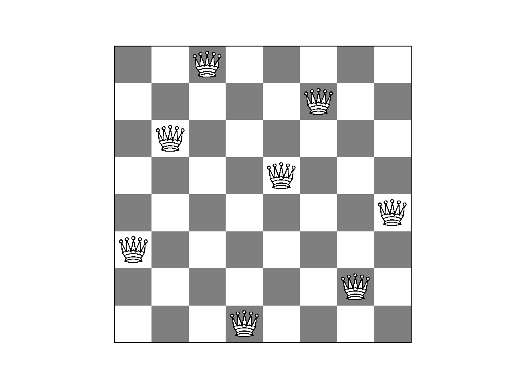

<div align="center">
  <h1>8 Queens Problem Genetig Algorithm</h1>
  
</div>

### Introduction 

The goal of this project is to solve the problem of placing 8 queens on a chessboard without any of them attacking one another using Machine Learning. More precisely, a Genetic algorithm is used to find one of the possible placements. The problem can be expanded to a larger grid solving the same problem. The size of the grid and the parameters of the genetic algorithm can be adjusted in the configurations. 

### Installation

1. Clone the repository: `git clone [repo-url]`
2. Install all dependencies: `pipenv install --dev`

### Run

```python
pipenv run python -m eight_queens